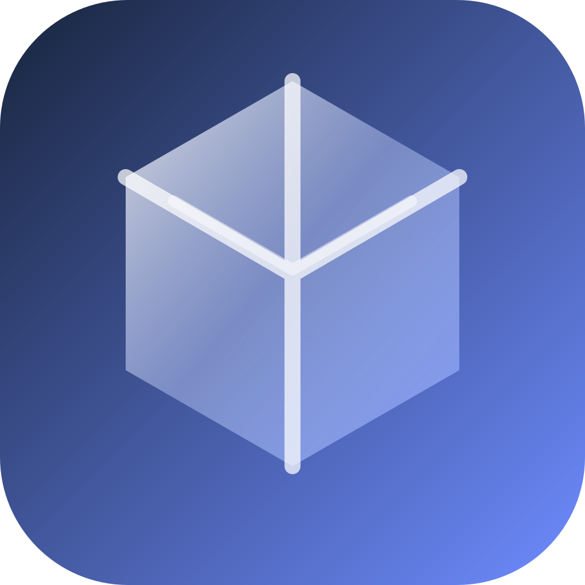
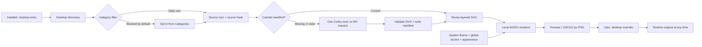
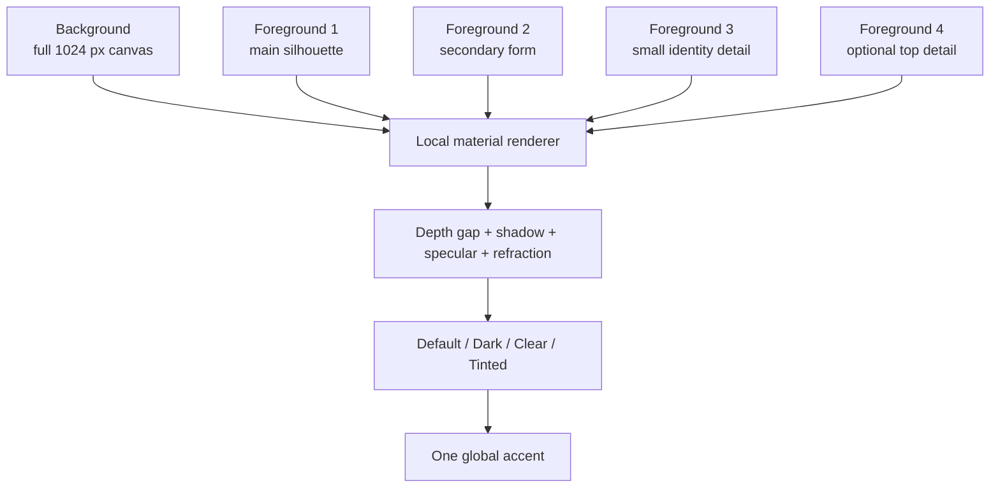

<p align="center">
  
</p>

<h1 align="center">LiquidGlassForLinux</h1>

<p align="center">
  <strong>Native Liquid Glass-style app icons for Linux.</strong><br>
  One clean layered source. One AI conversion. Every tint and material effect stays local.
</p>

<p align="center">
  <a href="https://www.rust-lang.org/"></a>
  <a href="https://gtk.org/4/"></a>
  <a href="https://wgpu.rs/"></a>
  <a href="https://github.com/OnurByte/LiquidGlassForLinux/blob/main/LICENSE"></a>
</p>

> Linux apps are great. Their icons just do not always look like they belong
> in the same room.

LiquidGlassForLinux discovers the applications installed on your desktop,
turns each eligible icon into one canonical layered SVG, and renders the
material locally with WGPU. It is a small native desktop app for people who
want the Liquid Glass feeling without replacing their whole Linux desktop or
hand-editing 126 icons one by one.

The important boundary is simple: **AI translates the artwork once; the local
renderer owns the look forever after.** Changing accent, System/Light/Dark,
Clear, Tinted or preview motion never sends another AI request.

## What you get

- Native GTK4/libadwaita desktop app with a real application launcher.
- Default provider: `codex exec`, reusing your existing Codex login instead of
  requiring OpenAI API credit.
- Optional Responses API provider with an in-memory, masked API-key field.
- Default model: `gpt-5.6-luna`, with model selection in the GUI and CLI.
- One conversion request per icon, cached by source hash and manifest version.
- One 1024×1024 SVG: an opaque background plus one to four foreground layers.
- Local WGPU material pass with depth, layer separation, safe-area fitting,
  refraction, shadows, specular response, Default/Dark/Clear/Tinted looks and
  one global accent.
- Batch theme and accent controls. Accent is a renderer uniform, never prompt
  text and never an app-specific AI setting.
- Daily-use categories enabled by default. Avahi/SSH server browsers,
  settings, system helpers and terminal entries stay out until you opt in.
- User-scoped icon installation with `.desktop` overrides and a Restore action;
  `/usr/share/applications` is not modified.
- Explicit Stop, a 120-second Codex timeout and no AI work at application
  startup.

## The shape of the system



## Why the layers matter

The source asset carries identity. The renderer carries material. This is the
part that makes the project feel closer to Apple's public layered-icon model
than to a static blur filter:



Every foreground layer is rasterized separately, fit into a centered safe
area, and composited at a different normalized depth. That is why a triangular
or wide icon does not get crushed into the rounded-square frame, and why an
icon still has depth when the pointer is not moving.

The canonical SVG deliberately contains no accent, appearance, blur, glow,
refraction or permanent shadow. A single converted asset can therefore produce
many local looks without being regenerated.

## Linux liquid-glass landscape

These projects are adjacent, not interchangeable. Most Linux liquid-glass
projects style the shell, the compositor or a complete desktop rice. This one
stays focused on the app-icon asset and installation layer.

| Project | Main scope | What it does well | Where this project is different |
| --- | --- | --- | --- |
| **LiquidGlassForLinux** | App icon conversion + local material rendering | One cached layered source per installed app; reversible user-scoped integration; global accent without another AI call | Focuses on app icons, not a full shell theme |
| [GNOME Shell Liquid Glass](https://github.com/ryohsuke1231/liquid-glass) | GNOME Shell UI | Custom `Clutter.ShaderEffect` work for panels, notifications, dock and menus | Changes the shell surface; it does not turn every installed app icon into a cached layered asset |
| [KDE Plasma Liquid Glass Theme](https://github.com/david-x3d/kde-plasma-liquid-glass-theme) | KDE Plasma rice/theme stack | Pulls together blur, transparency, rounded corners, decorations and an icon theme for a complete desktop look | Desktop-specific theme assembly; this project is toolkit-native and icon-focused |
| [Tahoe Style Icon Set](https://github.com/chris1111/IconSet-Tahoe-Style-Linux-Mac) | Prebuilt icon collection | Ready-made macOS Tahoe-inspired artwork for Linux, macOS and Windows | Static collection; no source-hash cache, category filter, provider boundary or reversible installer |
| [decant](https://github.com/kylebshr/decant) | Apple `.icon` research and extraction | Useful reverse-engineering reference for Apple's layered material data | Works with Apple's private formats and Icon Composer; it is not a Linux desktop icon installer |

The goal is not to pretend Linux is macOS. The goal is to bring the part that
actually matters here—the layered source plus runtime material separation—to a
native Linux workflow with clear boundaries and an escape hatch.

## Install

You need a Linux desktop session, a Rust toolchain, GTK4/libadwaita development
packages and a WGPU-compatible graphics adapter. For AI conversion, use either
an authenticated `codex` executable or an OpenAI API key.

```bash
git clone git@github.com:OnurByte/LiquidGlassForLinux.git
cd LiquidGlassForLinux
./scripts/install-desktop-app.sh
```

The installer builds the release binary and creates a user-scoped launcher.
Open **Liquid Glass Icons** from your application menu. The output and managed
icon state live below `$XDG_DATA_HOME/liquid-glass-icon/` (normally
`~/.local/share/liquid-glass-icon/`).

For a quick development launch:

```bash
cargo run --release --bin liquid-glass-icon-gui
```

## Providers and models

### Codex exec — the default

Log in to Codex once, make sure `codex` is on `PATH`, and launch the app. The
converter runs an ephemeral, read-only `codex exec` child with user config and
MCP hooks ignored. It receives one image, one strict output schema and one
identity-preserving SVG prompt. It does not need API credit.

```bash
cargo run --release -- --provider codex --model gpt-5.6-luna --output out
```

### Responses API — optional

Select **API key** in the GUI or provide the key only for the process that runs
the CLI:

```bash
OPENAI_API_KEY='...' \
  cargo run --release -- --provider api --model gpt-5.6-luna --output out
```

The GUI masks the key and keeps it in memory. It is not written to settings,
manifests, logs or command-line arguments.

## CLI shortcuts

```bash
# Convert visible, daily-use app categories.
cargo run --release -- --provider codex --output out

# Include system, settings, terminal and other utility entries deliberately.
cargo run --release -- --all-categories --output out

# Reconvert one app only; normal runs reuse a current cache.
cargo run --release -- --reconvert org.gnome.Calculator.desktop --output out

# Apply current cached SVGs without calling Codex or the API.
cargo run --release -- --apply-cache --output out

# Restore a managed launcher and original icon.
cargo run --release -- --restore org.gnome.Calculator.desktop
```

Generated data looks like this:

```text
out/apps/org.gnome.Calculator/
├── icon.svg
└── icon-manifest.json
```

## Safety and boring guarantees

- No AI work starts when the GUI opens.
- A changed source icon becomes `stale`; it is not silently regenerated.
- Invalid SVG output is rejected before replacing a previous valid conversion.
- A provider request is never made just because the accent or appearance
  changed.
- Stop cancels the active request or terminates the active Codex process group.
- Codex conversion fails after 120 seconds instead of hanging forever.
- Application icons are installed only in user data with user `.desktop`
  overrides. Original launchers remain available through **Restore**.
- Server browsers, settings, system utilities and terminals are classified and
  excluded by default, rather than wasting requests on everything discovered
  in `/usr/share/applications`.

## Project map

```text
src/bin/gui.rs       native GTK4/libadwaita application
src/desktop.rs       XDG desktop discovery and category filtering
src/pipeline.rs      cache-aware conversion orchestration
src/openai.rs        Codex exec and Responses API providers
src/prompt.rs        identity-only layered SVG prompt
src/svg.rs           SVG group validation and rasterization
src/renderer.rs      local WGPU material renderer
src/icon_install.rs  reversible user-scoped launcher/icon integration
docs/                contracts, Apple reference and embedding notes
schema/              strict icon manifest and provider response schemas
profiles/            default prompt/profile data
scripts/             desktop launcher installer
```

## Verification

```bash
cargo fmt --check
cargo test --all-targets --locked
cargo clippy --all-targets -- -D warnings
cargo build --release --bins
```

Offline tests mock the Responses API. A live provider smoke test is separate
because it requires a Codex login or billable API credentials.

## References and scope

- [Apple App Icons HIG](https://developer.apple.com/design/human-interface-guidelines/app-icons/)
- [Apple Materials](https://developer.apple.com/design/human-interface-guidelines/materials)
- [Creating an app icon using Icon Composer](https://developer.apple.com/documentation/xcode/creating-your-app-icon-using-icon-composer)
- [WWDC25: Create icons with Icon Composer](https://developer.apple.com/videos/play/wwdc2025/361/)
- [OpenAI Responses API](https://developers.openai.com/api/reference/cli/resources/responses/methods/create)
- [Codex non-interactive mode](https://learn.chatgpt.com/docs/non-interactive-mode)

Apple's final `.icon` container and exact renderer are platform-specific. This
project is an independent Linux implementation of the public, observable idea:
separable layers in the asset, dynamic material at render time.

LiquidGlassForLinux is not affiliated with or endorsed by Apple Inc.

## License

MIT. See [LICENSE](LICENSE).
